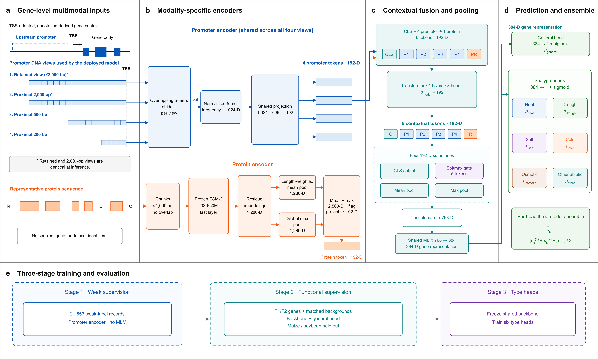
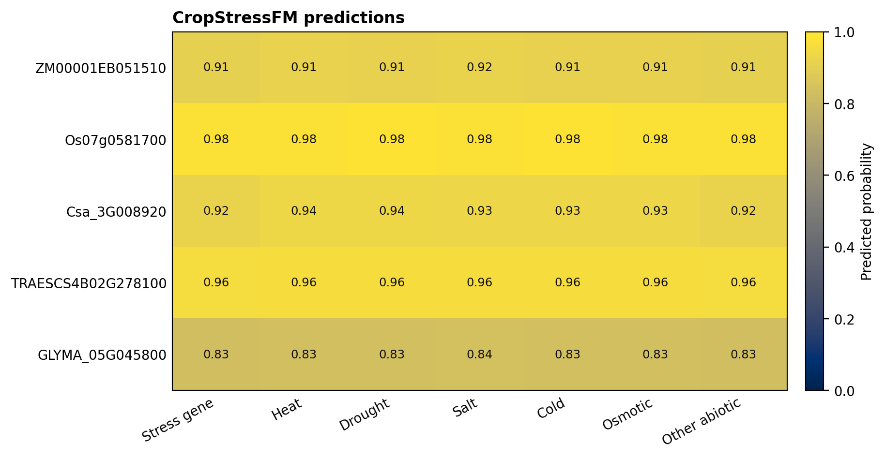

# CropStressFM

[](https://github.com/Qiu-Shizheng/CropStressFM/actions/workflows/tests.yml)
[](https://www.python.org/)
[](https://pytorch.org/)
[](LICENSE)

**CropStressFM** prioritizes crop genes for abiotic-stress function from a TSS-oriented promoter sequence and a protein embedding. It returns a general stress-gene probability and six independent stress-type scores: heat, drought, salt, cold, osmotic and other abiotic stress.

The release is a three-model ensemble. Pretrained inference weights, validation-derived thresholds, a complete command-line interface, input-preparation tools and public biological examples are included in this repository. Gene identifiers and species names are used only to align rows; they are not model features.



## What is included

| Component | Purpose |
|---|---|
| `cropstressfm prepare` | Extract strand-aware, non-overlapping upstream promoter sequences from a reference genome and GFF/GTF annotation |
| `cropstressfm embed-protein` | Generate the required 2,560-dimensional ESM-2 protein representation |
| `cropstressfm predict` | Run the three-seed CropStressFM ensemble and export CSV or JSON |
| Python API | Integrate promoter preparation, protein embedding and prediction into a workflow |
| Release weights | Three compact inference checkpoints plus six stress-specific heads per checkpoint |
| Real examples | Five experimentally supported crop stress genes, their sequences, embeddings, predictions and a figure |

## Quick start

### 1. Install

```bash
git clone https://github.com/Qiu-Shizheng/CropStressFM.git
cd CropStressFM
python -m venv .venv
source .venv/bin/activate
python -m pip install --upgrade pip
python -m pip install -e ".[all]"
```

For GPU inference, install the PyTorch build appropriate for the local CUDA driver before installing CropStressFM. The core predictor also runs on CPU.

### 2. Reproduce the bundled example

The repository already contains ESM-2 embeddings for five real genes, so this command does not download a model:

```bash
cropstressfm predict \
  --input examples/input/example_genes.csv \
  --embeddings examples/input/example_esm2_embeddings.npz \
  --output examples/output/my_predictions.csv \
  --plot examples/output/my_predictions.png \
  --device cpu
```

Expected general stress-gene scores and highest stress-type scores are:

| Public gene | Crop | Experimental evidence | Stress-gene probability | Highest type score |
|---|---|---|---:|---|
| `ZM00001EB051510` | Maize | Salt | 0.908 | Salt, 0.919 |
| `Os07g0581700` | Rice | Cold | 0.978 | Cold, 0.981 |
| `Csa_3G008920` | Cucumber | Cold and heat | 0.921 | Heat, 0.937 |
| `TRAESCS4B02G278100` | Wheat | Drought | 0.959 | Drought, 0.964 |
| `GLYMA_05G045800` | Soybean | Salt | 0.830 | Salt, 0.836 |

The complete output is available as [CSV](examples/output/example_predictions.csv), [JSON](examples/output/example_predictions.json) and a [prediction figure](examples/output/example_predictions.png). Public evidence and source links are in [example_metadata.csv](examples/input/example_metadata.csv).



## Run on new genes

### Required files

`genes.csv` must contain one row per gene:

```csv
id,promoter_sequence
gene_001,ACTG...ACGT
gene_002,TTGA...CGTA
```

`proteins.fasta` must use exactly the same identifiers:

```fasta
>gene_001
MSTNPKPQRKTKRNTNRRPQDVKFPGGGQIVGGVYLLPRRG
>gene_002
MAEAPQTVEELKQLAAAGVEVVVDD
```

The promoter sequence must be oriented in the direction of transcription. Its rightmost base is the base nearest the transcription start site (TSS). CropStressFM uses at most the rightmost 2,000 bp and derives 200, 500 and 2,000 bp proximal views internally.

### Generate protein embeddings

```bash
cropstressfm embed-protein \
  --fasta proteins.fasta \
  --output esm2_embeddings.npz \
  --device cuda
```

The first run downloads the public `esm2_t33_650M_UR50D` checkpoint to the PyTorch cache. On an offline system, download the checkpoint in advance and provide it explicitly:

```bash
cropstressfm embed-protein \
  --fasta proteins.fasta \
  --output esm2_embeddings.npz \
  --checkpoint /path/to/esm2_t33_650M_UR50D.pt \
  --device cuda
```

Each protein is split into non-overlapping chunks of at most 1,000 residues. CropStressFM concatenates the residue-length-weighted mean and global maximum of the last ESM-2 layer, producing 2,560 features per gene.

### Predict

```bash
cropstressfm predict \
  --input genes.csv \
  --embeddings esm2_embeddings.npz \
  --output predictions.csv \
  --plot predictions.png \
  --device auto \
  --batch-size 64
```

`--device auto` selects CUDA when available and otherwise uses CPU.

## Prepare inputs from a genome annotation

CropStressFM can create aligned promoter and protein files from a reference genome, a matching GFF3/GTF annotation and an optional protein FASTA:

```bash
cropstressfm prepare \
  --genome reference_genome.fa \
  --annotation genes.gff3 \
  --proteins representative_proteins.fa \
  --gene-list target_gene_ids.txt \
  --output-dir prepared_inputs \
  --upstream 2000 \
  --feature-type gene \
  --gene-id-key ID
```

The command writes:

- `prepared_inputs/genes.csv`: promoter sequence, length, chromosome, strand and genomic interval
- `prepared_inputs/proteins.fasta`: proteins whose identifiers match the prepared genes
- `prepared_inputs/preparation_report.json`: retained, skipped and missing records

Promoters are extracted upstream of the annotated TSS, clipped at the nearest non-overlapping annotated gene and capped at 2,000 bp. Minus-strand promoters are reverse-complemented so every sequence has the same transcriptional orientation. See [Input Preparation](docs/INPUT_PREPARATION.md) before processing a new annotation release.

## Python API

```python
import csv
import numpy as np

from cropstressfm import CropStressFM, embed_proteins, read_fasta

proteins = read_fasta("proteins.fasta")
ids, embeddings = embed_proteins(proteins, device="cuda")

with open("genes.csv", encoding="utf-8") as handle:
    rows = {row["id"]: row["promoter_sequence"] for row in csv.DictReader(handle)}

promoters = [rows[identifier] for identifier in ids]
predictor = CropStressFM(device="cuda", batch_size=64)
predictions = predictor.predict(promoters, embeddings, ids=ids)

print(predictions[0]["stress_gene_probability"])
print(predictions[0]["stress_gene_prediction"])
print(predictions[0]["top_stress_type"])
print(predictions[0]["drought_probability"])
```

An embedding matrix loaded from another workflow may have either 2,560 columns or 2,561 columns. CropStressFM appends the required availability indicator to a 2,560-column ESM-2 matrix and applies the frozen training scaler.

## Output interpretation

| Field | Meaning |
|---|---|
| `stress_gene_probability` | Ensemble mean for general abiotic-stress gene prioritization |
| `stress_gene_probability_sd` | Standard deviation among the three independently trained models |
| `stress_gene_prediction` | Whether the ensemble score exceeds the validation-derived threshold |
| `top_stress_type` | Stress type with the largest independent type score |
| `<type>_probability` | Ensemble mean from the binary head for one stress type |
| `<type>_prediction` | Whether that type score exceeds its own validation-derived threshold |
| `gate_*` | Mean fusion weight assigned to each promoter view or the protein token |

The six stress-type outputs are independent binary scores and do not sum to one. A gene may pass several thresholds or none. The highest type is useful for prioritization, while the full score vector and seed-to-seed variation should be retained for decision making.

## Model architecture

1. The promoter encoder calculates collision-free normalized frequencies for every possible DNA 5-mer in four TSS-proximal sequence views. Each view is projected through a shared rank-96 encoder.
2. The protein encoder uses a frozen ESM-2 650M model. Residue-weighted mean and global maximum pooling produce 2,560 features, which are standardized and projected to the shared token dimension.
3. Four promoter tokens and one protein token enter a four-layer, eight-head Transformer with a 192-dimensional hidden representation.
4. A learned attention gate combines token representations. A shared 768-dimensional fusion head produces the general stress-gene score.
5. Six frozen-backbone task heads produce independent stress-type scores. Final probabilities are averaged across seeds 41, 42 and 43.

The compact inference release contains approximately 3.30 million parameters per ensemble member, excluding the frozen 650M-parameter ESM-2 encoder used to create protein embeddings.

## Hardware and measured runtime

Measurements used PyTorch 2.6, two CPU threads and an NVIDIA H20 GPU. They are reference values, not guarantees.

| Operation | Hardware | Batch | Time | Peak memory reported by process |
|---|---|---:|---:|---:|
| Core ensemble load | CPU | n/a | 0.25 s | 393 MiB RAM |
| Core ensemble, warm single-gene inference | CPU | 1 | 0.023 s | 393 MiB RAM |
| Core ensemble, warm 100-gene inference | CPU | 100 | 1.29 s | 397 MiB RAM |
| Core ensemble load | H20 | n/a | 0.82 s | 79 MiB allocated VRAM |
| Core ensemble, warm 100-gene inference | H20 | 100 | 0.60 s | 79 MiB allocated VRAM |
| ESM-2 load and one short protein | H20 | 1 | 25.7 s | 2.62 GiB allocated VRAM; 5.49 GiB process RAM |

Recommended practical minimums are 2 CPU cores and 2 GiB RAM for predictions from existing embeddings. ESM-2 embedding generation should use at least 8 GiB system RAM and 4 GiB free GPU memory for short proteins; long proteins and larger batches need more headroom. The ESM-2 checkpoint occupies approximately 2.6 GB on disk.

## Scope and limitations

CropStressFM is a candidate-prioritization model. A high score is not evidence of causal stress tolerance and should be followed by genetic, physiological or field validation. Predictions use promoter DNA and protein sequence only; tissue, developmental stage, treatment intensity, chromatin state and environmental interactions are not direct inputs.

Performance can shift with annotation quality, gene-family composition and crop divergence. Protein isoform selection and TSS orientation materially affect the input. Stress-type labels are less abundant than general functional labels, so type scores should be interpreted with their thresholds and ensemble standard deviations. Probabilities are not guaranteed to be calibrated for every species.

## Documentation

- [Five-minute quick start](docs/QUICKSTART.md)
- [Input preparation](docs/INPUT_PREPARATION.md)
- [Python and CLI API](docs/API.md)
- [Model card and evaluation](docs/MODEL_CARD.md)
- [Troubleshooting](docs/TROUBLESHOOTING.md)

## Reference

The protein encoder is ESM-2: Lin, Z. *et al.* Evolutionary-scale prediction of atomic-level protein structure with a language model. *Science* **379**, 1123-1130 (2023). [https://doi.org/10.1126/science.ade2574](https://doi.org/10.1126/science.ade2574)

## License

CropStressFM source code and release weights are provided under the [MIT License](LICENSE). ESM-2 is an external dependency distributed by its authors under its own terms.
